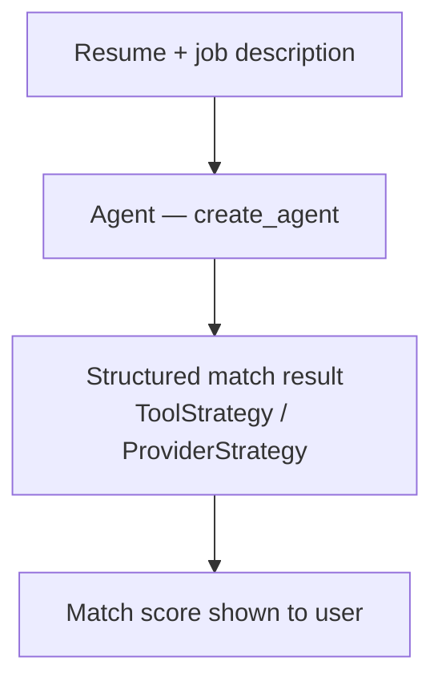
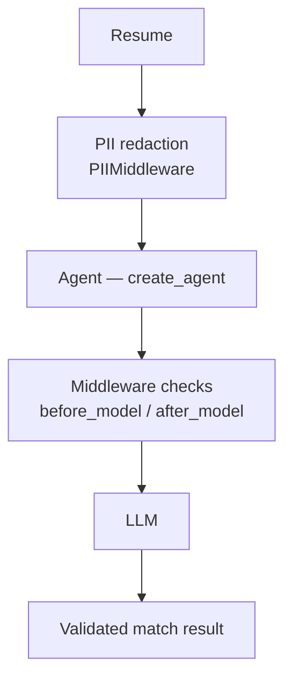
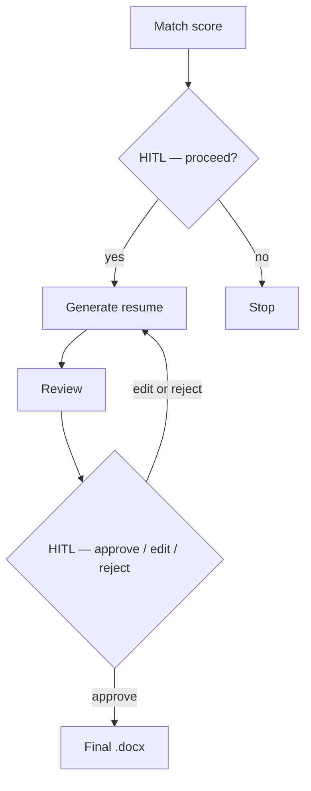
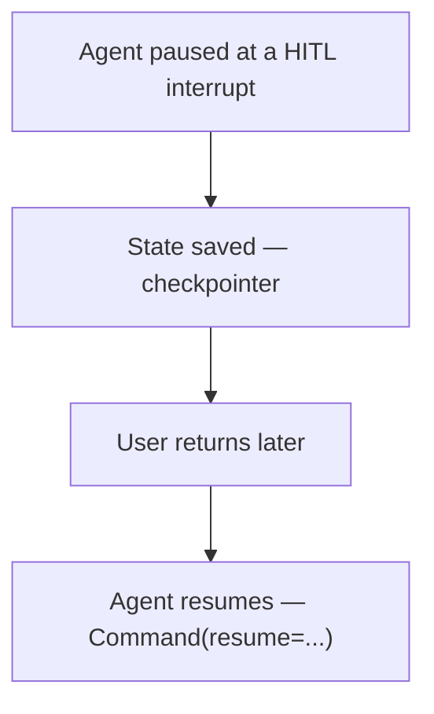
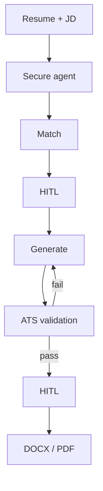
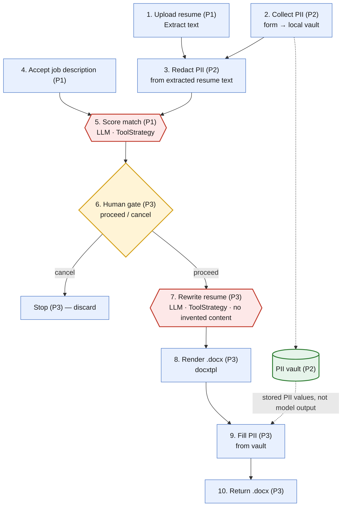

# PII Boundary

A privacy-preserving resume/job-match assistant built on [LangChain 1.0](https://python.langchain.com/). It scores how well a resume fits a job description, then produces a tailored `.docx` resume — without ever sending the candidate's personal information to an LLM.

The project is built in **4 incremental phases**, each one a working, demoable piece of functionality and a deliberate slice of the LangChain 1.0 surface area. This README documents both the phase-by-phase build plan and the target architecture Phase 3 arrives at.

## Overview

Resume-matching tools typically hand a candidate's full resume — name, email, phone, location, and all — straight to a third-party model. **PII Boundary** takes a different approach: it treats personally identifiable information as data that never needs to leave the local process to do its job.

The core idea, introduced from Phase 2 onward, is a **local PII vault**. When a user uploads a resume, the app also collects their first name, last name, email, phone, and location through a plain form. Those values are stored locally and are *never included in any prompt sent to the LLM*. Before any resume text reaches a model, every one of those exact strings is redacted from it. The LLM only ever sees de-identified resume content and the job description.

The two places where the model actually exercises judgment — scoring the match, and rewriting resume content for the role — are isolated, structured-output calls with tightly scoped inputs and outputs. From Phase 3 onward, a **human gate** sits between them: the user sees the match score and explicitly chooses to proceed or cancel before any rewriting happens.

Once the model has produced its rewritten content, the pipeline goes fully deterministic again: the content is rendered into a pre-built `.docx` template, and the PII fields in that template are filled in afterward from the local vault — not from anything the model returned. The model never sees real PII, and it never has the opportunity to invent, alter, or leak it, because it's never given it in the first place.

> **Note:** this privacy design ships incrementally. Phase 1's first working version deliberately has *no* PII handling — it's a bare agent call used to validate the core `create_agent` / structured-output pattern before anything else is layered on. Redaction and middleware arrive in Phase 2; the human gate, rewrite, and document generation arrive in Phase 3.

## Build roadmap

| Phase | Produces | Core question | LangChain concepts |
|---|---|---|---|
| 1 — Agent Fundamentals | Resume/JD Match Analyzer | "Does my resume match this job?" | `create_agent`, tools, state, context, runtime, structured output, `ProviderStrategy`, `ToolStrategy` |
| 2 — Middleware | Secure + controlled Resume Analyzer | "Can I do this securely and control the agent?" | node-style vs. wrap-style middleware, `before_model`, `after_model`, `wrap_model_call`, `wrap_tool_call`, dynamic prompts, retry/error middleware, `PIIMiddleware` |
| 3 — HITL + Checkpointing | Interactive Resume Application Assistant | "Can a human approve important agent decisions?" | HITL (`interrupt()`, `Command(resume=...)`, approve/edit/reject/respond), checkpointer, state persistence |
| 4 — Production / Advanced | Production-like Resume Optimization Platform | "Can this behave like a production application?" | shell tool, model fallback, summarization, tool call limits, tool selection, tool emulator, streaming, store, batch, observability |

**Phase 3 is already a strong, complete portfolio project.** Phase 4 exists to demonstrate the rest of the LangChain surface area, not because the MVP requires it.

### Phase 1 — Agent Fundamentals



User gets:

```
Match Score: 82%

Matched:
- Python
- FastAPI
- LangChain

Missing:
- Kubernetes
- AWS

Experience Gap:
- Job asks for 5 years; resume shows 3
```

No PII handling, no middleware, no HITL — deliberately unguarded, to isolate the core agent-call pattern before anything else is added.

### Phase 2 — Middleware



The same Phase 1 application becomes security-aware. It can now:

- Remove PII before the model sees it
- Block accidental PII leakage
- Validate model responses
- Dynamically change prompts
- Retry failed tools
- Handle tool errors
- Validate before/after agent execution

### Phase 3 — HITL + Checkpointing

The user now controls the important decisions:



And if the user leaves mid-flow, the session doesn't just die:



### Phase 4 — Production / Advanced



Additional capabilities layered on here:

- **Shell tool** — generate/convert documents and run ATS scripts
- **Model fallback** — continue if the primary model fails
- **Summarization** — handle very long applications
- **Tool limits** — prevent runaway agent loops
- **Tool selection** — control which tools are exposed
- **Tool emulator** — test without executing real tools
- **Streaming** — show agent progress in the UI
- **Store** — remember resume preferences/templates
- **Batch** — compare one resume against multiple job descriptions
- **Observability** — trace/debug everything

## Target architecture (reached at Phase 3)

The diagram below is the full pipeline Phase 3 arrives at — the same 10 fixed steps regardless of phase, just built up incrementally. Each node is tagged with the phase that introduces it. Steps in **red** are the only two places an LLM makes a judgment call. The step in **amber** is a human decision. Note how the PII vault's data flows directly from step 2 to step 9 — introduced in Phase 2, still never touching either LLM call once Phase 3 adds the rewrite/render steps around it.



**Legend**

| Color | Meaning |
|---|---|
| 🔵 Blue | Deterministic code — no model involvement |
| 🔴 Red | LLM judgment step — structured output via a Pydantic schema |
| 🟡 Amber | Human gate — the user decides, not the model (Phase 3) |
| 🟢 Green | Local PII vault — populated at step 2, consumed at step 9 (Phase 2), never exposed in between |

### Why this shape matters

- **Redaction happens before the first LLM call, not after** — from Phase 2 onward, the model never has real PII in its context window to begin with.
- **The vault bypasses both LLM calls entirely.** It's plumbed directly from collection (step 2) to template-filling (step 9); the model's output is never the source of PII in the final document.
- **The human gate sits between the two LLM calls (Phase 3).** The rewrite never runs without an explicit, informed decision by the user.
- **The rewrite step is constrained, not creative.** It's scoped to reordering/rephrasing existing resume content, with a hard constraint against inventing experience, skills, or numbers not already in the source text.
- **Template rendering is deterministic.** `docxtpl` fills a pre-built template with content and PII placeholders — the model has no path to directly control document structure or formatting.

## Backend Tech Stack

| Concern | Choice | Introduced |
|---|---|---|
| Language | Python 3.11+ | Phase 1 |
| Agent / LLM orchestration | `langchain` 1.0 — `create_agent`, structured output via `ToolStrategy` / `ProviderStrategy` | Phase 1 |
| LLM provider | `init_chat_model` — OpenAI or Anthropic, swappable behind one call | Phase 1 |
| Schemas / validation | `pydantic` — score/rationale/category schema, rewrite-output schema | Phase 1 |
| Resume text extraction | `pypdf` (PDF), `python-docx` (DOCX) | Phase 1 |
| PII handling | `PIIMiddleware` / custom `AgentMiddleware` (`before_model`, `after_model`, `wrap_model_call`, `wrap_tool_call`) | Phase 2 |
| HITL & persistence | LangGraph `interrupt()`, `Command(resume=...)`, checkpointer (`InMemorySaver` → durable store later) | Phase 3 |
| Document generation | `docxtpl` + `python-docx` — deterministic template rendering | Phase 3 |
| Testing | `pytest` | Phase 1, growing every phase |
| Robustness/production extras | shell tool, model fallback, summarization, tool call limits, tool selection, tool emulator, streaming, store, batch, observability | Phase 4 (optional) |

## Backend-only scope (for now)

This repository currently covers **backend only**. No web framework and no UI stack have been chosen yet. The pipeline is built as plain, independently testable Python functions/modules — no assumption is baked in about what will eventually call them (CLI, REST API, notebook, or a future frontend).

A UI package is planned but intentionally **not scaffolded yet** — it will be added once the backend pipeline and its interfaces stabilize.

### Module growth by phase

```
backend/
  schemas.py               # P1 — MatchResult, later RewrittenResume
  config.py                 # P1 — init_chat_model provider selection
  extraction/                # P1 — pypdf / python-docx text extraction
  matching/                  # P1 — score_match agent call
  tests/                      # P1 onward — one suite per module

  pii/                        # P2 — vault.py, redactor.py
  middleware/                 # P2 — custom AgentMiddleware subclasses

  rewriting/                  # P3 — rewrite_resume agent call
  rendering/                  # P3 — docxtpl rendering, templates/
    templates/
  pii/refiller.py              # P3 — fills PII placeholders from the vault
  pipeline.py                  # P3 — the StateGraph orchestrator, human-gate boundary

  validation/                  # P4 — ATS checks + retry
  tools/                        # P4 — shell tool, etc.
```

Each row is additive — nothing from an earlier phase is rewritten to accommodate a later one; the module boundaries are chosen so later phases only add files, not reshape existing ones.

## Status

Early stage — architecture, roadmap, and interfaces defined here; Phase 1 implementation in progress.
